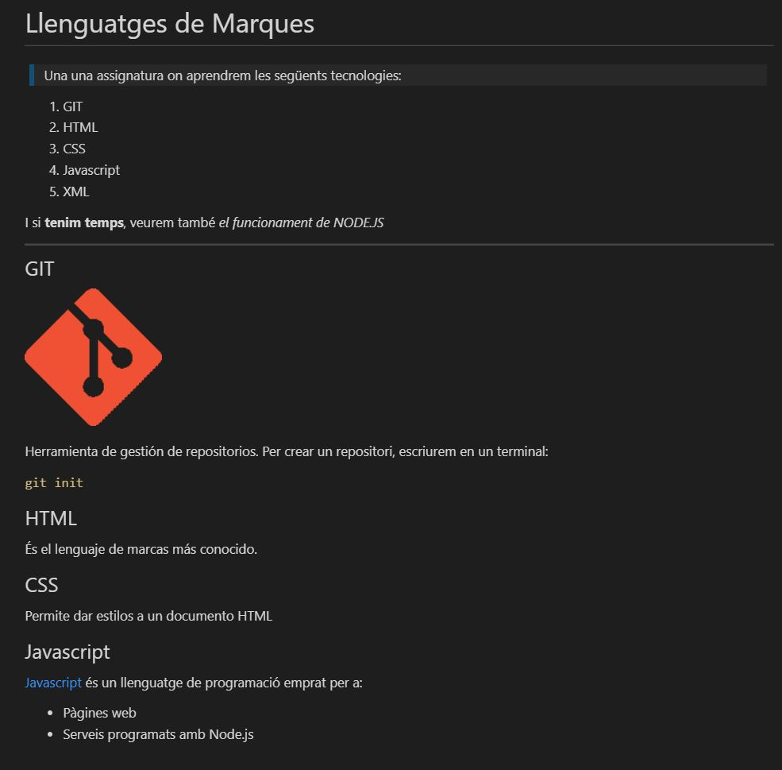

# LLenguatges de Marques

> És una assignatura on aprendrem les següents tecnologies:
 1. GIT
 1. HTML
 1. CSS
 1. Javascript
 1. XML

I si **tenim temps**, veurem també el funcionament de *NODE.JS*

---
GIT

Herramienta de gestión de repositorios.
Per crear un repositori, escriurem en un terminal:

`git init`

##### HTML
És el lenguaje de marcas más conocido.

##### CSS
Permite dar estilos a un documento HTML

##### Javascript

[Javascript](https://es.wikipedia.org/wiki/JavaScript "Javascript") és un llenguatge de programació emprat per a:

    * Pàgines web
    * Serveis programats amb Node.js

